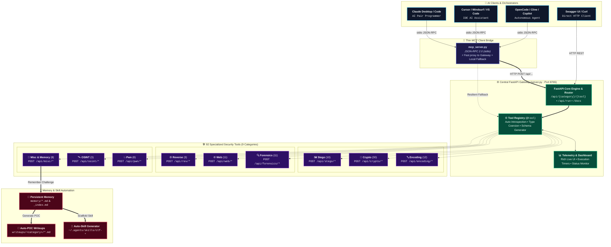

<div align="center">

```text
 ██████╗████████╗███████╗    ██╗  ██╗██╗████████╗
██╔════╝╚══██╔══╝██╔════╝    ██║ ██╔╝██║╚══██╔══╝
██║        ██║   █████╗      █████╔╝ ██║   ██║   
██║        ██║   ██╔══╝      ██╔═██╗ ██║   ██║   
╚██████╗   ██║   ██║         ██║  ██╗██║   ██║   
 ╚═════╝   ╚═╝   ╚═╝         ╚═╝  ╚═╝╚═╝   ╚═╝   
    ⚡ AI-POWERED CTF & CYBERSECURITY ENGINE ⚡
```

# CTF KIT — AI-Powered Security & CTF Engine

**Modular cybersecurity toolkit covering 103 specialized tools across 9 categories.**  
*Designed specifically for AI Agents (Claude Desktop, Cursor, Cline, OpenCode, Copilot) via MCP & Headless REST API.*

</div>

---

## 🏛️ MCP Agent & Central Gateway Architecture

CTF KIT follows the modern **Central FastAPI Gateway + Thin MCP Bridge** pattern. A single central server (`server.py`) manages execution, telemetry, thread pools, and category routing, while `mcp_server.py` operates as an ultra-fast JSON-RPC bridge with resilient local fallback.



---

## 🚀 Installation & Setup

### Prerequisites
- **Python**: 3.10+ (tested on Python 3.10, 3.11, 3.12, 3.13)
- **Git**: Installed and available in PATH

---

### Step 1: Clone the Repository
```bash
git clone https://github.com/clone4truth/ctf-kit.git
cd ctf-kit
```

---

### Step 2: Create & Activate Virtual Environment

**Windows (PowerShell):**
```powershell
python -m venv .venv
.\.venv\Scripts\Activate.ps1
```

**Windows (Command Prompt):**
```cmd
python -m venv .venv
.\.venv\Scripts\activate.bat
```

**Linux / macOS (Bash / Zsh):**
```bash
python3 -m venv .venv
source .venv/bin/activate
```

---

### Step 3: Install Dependencies
```bash
pip install --upgrade pip
pip install -r requirements.txt
```

---

### Step 4: Generate Test Assets & Validate Installation
```bash
# 1. Generate synthetic test data (PNG, WAV, PCAP, ELF, PE)
python tests/gen_testdata.py

# 2. Run smoke tests (verify all 92 security tools)
python tests/test_smoke.py

# 3. Verify MCP stdio JSON-RPC handshake
python tests/test_mcp.py
```

---

## ⚡ Running the Services

### 🌐 1. Start Main REST API Server (FastAPI + Swagger UI)
```bash
python server.py
```
* **Swagger UI Documentation:** [http://localhost:8765/docs](http://localhost:8765/docs)
* **ReDoc Interface:** [http://localhost:8765/redoc](http://localhost:8765/redoc)
* **Telemetry & Health Endpoint:** [http://localhost:8765/health](http://localhost:8765/health)

### 🔌 2. Run Headless MCP Server (for AI Agents)
```bash
python mcp_server.py
```

---

## 🔌 Use with MCP Clients (Claude / Cursor / VS Code / OpenCode / Other Agents)

### Auto-Install into App Config Folders

Agent integration is NOT kept in repo dot-directories — no project-level agent
config or plugin folders needed. On every `mcp_server.py` start (and
via `python scripts/install_agents.py`), everything is installed idempotently
into each agent CLI's own config folder:

| Artifact | Repo source | Installed to |
|---|---|---|
| ctf-memory plugin | `plugins/ctf-memory.js` | `~/.config/opencode/plugins/` + `plugin` array (opencode); at runtime it also writes CTF skills to `~/.agents/skills` and `~/.claude/skills` |
| `ctf-tools` MCP server | `mcp_server.py` (auto) | `~/.config/opencode/opencode.json` (`mcp`), `~/.claude.json`, `~/.cursor/mcp.json`, `~/.gemini/settings.json`, `~/.codeium/windsurf/mcp_config.json` (`mcpServers`) |

- **OS-aware**: uses `.venv/Scripts/python.exe` on Windows, `.venv/bin/python` on Linux/macOS (falls back to the running interpreter if the venv is missing).
- **Idempotent**: existing entries (other MCP servers, plugins, providers, project state) in every target config are preserved; missing configs are skipped.
- Project-level `.mcp.json` (in this repo) still works for clients that prefer local configs — see `mcp.example.json` for the template.

Manual registration for any other client (e.g. `claude_desktop_config.json` or `.cursor/mcp.json`):

```json
{
  "mcpServers": {
    "ctf-tools": {
      "command": ".venv/Scripts/python",
      "args": ["mcp_server.py"],
      "env": {
        "PYTHONUNBUFFERED": "1"
      }
    }
  }
}
```

---

## 🧠 Memory, Recall & Auto-Skill System

CTF KIT features a persistent knowledge loop that turns every solved challenge or lab into permanent agent capability:

```
[Challenge / Lab Input]
        │
        ├──▶ 1. Plan & Recall  : recall_knowledge / scripts/recall.py (Search past memory)
        ├──▶ 2. Solve          : Execute via 92 MCP Tools
        └──▶ 3. Remember       : remember_challenge / scripts/remember.py
                  │
                  ├──▶ memory/*.md                  (Indexed Challenge Memory)
                  ├──▶ ~/.agents/skills/ctf-*        (Auto-Generated Agent Skills)
                  └──▶ writeups/<category>/*.md     (Auto-Scaffolded POC Walkthroughs)
```

### Tri-Fold Knowledge Asset
When you recover a flag and call `remember_challenge`:
1. **Challenge Memory (`memory/`)**: Records target platform, tools used, recovered flag, and lessons learned. Automatically updates `memory/_index.md`.
2. **Autonomous Agent Skills (`~/.agents/skills/` & `~/.claude/skills/`)**: Generates standardized `SKILL.md` files with YAML frontmatter. Cumulative additions are appended if a similar skill exists.
3. **POC Writeup (`writeups/`)**: Scaffolds a reproducible writeup template populated with terminal commands, payload parameters, and BurpSuite workflows tailored to the challenge category.

```powershell
# Save memory directly via CLI or via MCP Tool remember_challenge:
python scripts/remember.py --title "RSA Fermat Factorization" --category crypto --tool rsa_fermat --flag "flag{fermat_crack_ok}" --note "n was product of close primes; factored in 0 iterations"
```

---

## 🧰 Complete Tool Arsenal (103 Tools across 9 Categories)

| Category | Count | Tools & Descriptions |
|---|---|---|
| **encoding** | 12 | `decode_base` (Base2/8/16/32/36/58/62/64/85), `decode_base45`, `decode_base91`, `decode_chain` (auto-unpacker multi-layer), `decode_zero_width`, `encode_zero_width`, `encode_url`, `encode_html_entities`, `encode_unicode_escapes`, `morse`, `brainfuck`, `decode_all` |
| **crypto** | 31 | `rsa_wiener`, `rsa_fermat`, `rsa_common_modulus`, `rsa_hastad`, `rsa_parse_key`, `rsa_decrypt`, `rsa_small_e`, `xor_crib_drag`, `xor_brute`, `xor_keyed`, `lcg_solve`, `hash_length_extension`, `caesar`, `atbash`, `affine`, `vigenere`, `beaufort`, `playfair`, `hill` 2x2, `railfence`, `columnar`, `bacon`, `rot47`, `frequency`, `vigenere_keylength`, `aes_crypt`, `aes_cbc_bitflip`, `hash_identify`, `hash_generate`, `hash_crack_common`, `external_crypto` (hashcat/john wrapper) |
| **stego** | 11 | `png_fix_ihdr` (CRC dimension recovery), `stego_audio_wav` (LSB extraction), `stego_dtmf_detect` (keypad tones), `stego_lsb`, `stego_metadata`, `stego_channel`, `stego_xor_images`, `stego_png_chunks`, `stego_gif_frames`, `stego_compare`, `external_stego` (steghide/zsteg/outguess wrapper) |
| **forensics** | 12 | `file_type`, `strings_extract`, `hexdump`, `carve` (15+ file signatures), `zlib_hunt`, `entropy_map`, `pcap_http` (PCAP/PCAPNG streams), `pcap_dns_exfil`, `pcap_usb_keystrokes`, `zip_fix_pseudo_encrypt`, `exif_gps_map`, `external_forensics` (binwalk/exiftool/foremost/volatility3 wrapper) |
| **web** | 12 | `ssti_payloads` (Jinja2/Twig/Smarty/SpEL/Thymeleaf/EJS/ERB), `revshell_generator` (multi-language & base64/URL wrappers), `php_filter_chain`, `ssrf_obfuscator`, `jwt_key_confusion` (CVE-2015-9235), `jwt_decode`, `jwt_forge`, `http_request`, `payload_encoders`, `sqli_payloads`, `browser_agent` (headless Chrome: JS-rendered content, screenshot, forms, security headers), `external_web` (ffuf/gobuster/sqlmap/nikto/wfuzz wrapper) |
| **rev** | 4 | `pe_info` (Windows PE32/PE32+ mitigations & sections), `elf_info` (Linux ELF header & symbols), `pyc_magic_info` (Python bytecode version identifier), `external_rev` (objdump/readelf/radare2/one_gadget wrapper) |
| **pwn** | 8 | `checksec`, `rop_gadgets`, `fmtstr_payload_gen`, `pwn_template` (pwntools exploit scaffolding), `shellcode_multi` (Linux x86/x64, Win x86/x64, ARM), `shellcode_x64`, `debruijn`, `debruijn_find` |
| **osint** | 4 | `dns_query` (A/AAAA/MX/NS/TXT/CNAME/SOA), `dns_reverse` (PTR lookup), `crtsh_subdomains` (Certificate Transparency logs), `external_recon` (nmap/masscan/whatweb/dnsrecon wrapper) |
| **misc** | 9 | `detect_challenge` (heuristics & platform classifier), `extract_flags_tool` (universal flag regex parser), `remember_challenge` (memory + skill + POC generator), `recall_knowledge` (semantic memory search), `triage_file` (unified file deep inspection), `analyze_target` + `select_tools` + `optimize_parameters` (decision engine), `external_available` (installed external tools report) |

---

## 📁 Project Structure

```
ctf-kit/
├── ctfkit/
│   ├── logging.py          # LogBus & structured rich logging
│   ├── registry.py         # @tool() decorator + run_tool + list_tools + auto type coercion
│   ├── cache.py            # LRU result cache (hits/misses/evictions via /api/cache/stats)
│   ├── utils.py            # shared helpers: hex, english scoring, magic bytes, param introspection
│   └── modules/            # category implementations (encoding, crypto, stego, forensics, web, rev_pwn, osint, analyze, browser)
├── tests/                  # automated test suite & generators
│   ├── gen_testdata.py     # generate test files (PCAP, PNG, audio WAV, ELF, PE)
│   ├── test_smoke.py       # 87 smoke tests covering all tools
│   └── test_mcp.py         # MCP JSON-RPC stdio handshake & protocol test
├── scripts/                # automated workflow helpers (plan, recall, remember, new_tool, writeup, install_agents)
├── plugins/                # ctf-memory.js (auto-installed into all agent CLI configs by scripts/install_agents.py)
├── server.py               # Main Central Gateway (FastAPI / Uvicorn + Swagger docs at /docs)
├── mcp_server.py           # Headless MCP stdio server & Gateway Bridge
├── memory/                 # per-challenge persistent memory + _index.md
├── writeups/<category>/    # step-by-step POCs with terminal commands
├── wordlists/              # common passwords, directories, headers
└── pyrightconfig.json      # Python IDE & language server configuration
```

---

## 📌 Technical Notes

- `rsa_decrypt` automatically falls back through raw plaintext, PKCS1v15, and OAEP.
- `aes_crypt` automatically attempts PKCS7 and unpadded decryption for ECB/CBC.
- `stego_lsb` supports custom bit planes (LSB/MSB) and configurable bit extraction order.
- `pcap_http` contains a lightweight, zero-dependency parser for Ethernet/IPv4/TCP streams.
- Synthetic demo test assets are located in `testdata/` (regenerated via `python tests/gen_testdata.py`).
- **Decision Engine**: `POST /api/intelligence/{analyze-target,select-tools,optimize-parameters}` — category detection, keyword-ranked tool recommendation, and parameter contracts from the registry.
- **Smart Cache**: LRU (256 entries) on all tool results — `GET /api/cache/stats` for hit/miss/eviction telemetry.
- **Browser Agent**: `browser_agent` (Selenium 4.6+, headless Chrome auto-managed) for CTF web challenges — dump JS-rendered content, screenshots, form recon, security headers.