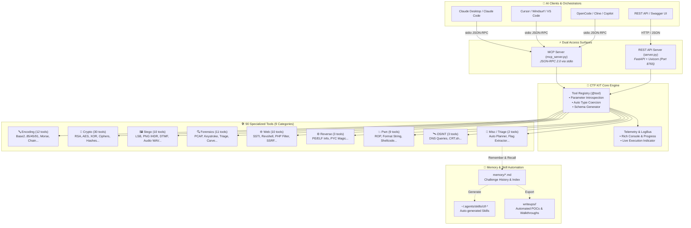

<div align="center">

```text
 ██████╗████████╗███████╗    ██╗  ██╗██╗████████╗
██╔════╝╚══██╔══╝██╔════╝    ██║ ██╔╝██║╚══██╔══╝
██║        ██║   █████╗      █████╔╝ ██║   ██║   
██║        ██║   ██╔══╝      ██╔═██╗ ██║   ██║   
╚██████╗   ██║   ██║         ██║  ██╗██║   ██║   
 ╚═════╝   ╚═╝   ╚═╝         ╚═╝  ╚═╝╚═╝   ╚═╝   
    ⚡ AI-POWERED CTF & CYBERSECURITY ENGINE ⚡
```

# CTF KIT — AI-Powered Security & CTF Engine

**Modular cybersecurity toolkit covering 90 specialized tools across 9 categories.**  
*Designed specifically for AI Agents (Claude Desktop, Cursor, Cline, OpenCode, Copilot) via MCP & Headless REST API.*

</div>

---

## 🏛️ MCP Agent Architecture



---

## ⚡ Quickstart

```powershell
python -m venv .venv
.venv\Scripts\pip install -r requirements.txt
.venv\Scripts\pip install rich

# 1. Start the REST Server (Terminal)
.venv\Scripts\python server.py          # -> http://localhost:8765/docs

# 2. Run Headless MCP Server (for AI Agents)
.venv\Scripts\python mcp_server.py

# 3. Tests & Validation
.venv\Scripts\python tests/gen_testdata.py
.venv\Scripts\python tests/test_smoke.py   # 85 tests covering all tools
.venv\Scripts\python tests/test_mcp.py     # MCP handshake verification
```

---

## 🔌 Use with MCP Clients (Claude / Cursor / VS Code / OpenCode)

Use `mcp.json` or `mcp.example.json` to register `ctf-tools` in your client config (e.g. `claude_desktop_config.json` or `.cursor/mcp.json`):

```json
{
  "mcpServers": {
    "ctf-tools": {
      "command": ".venv/Scripts/python",
      "args": ["mcp_server.py"],
      "env": {
        "PYTHONUNBUFFERED": "1"
      }
    }
  }
}
```

---

## 🧰 Tools by Category (90 Tools)

| Category | Count | Tools |
|---|---|---|
| **encoding** | 12 | `decode_base` (2/8/16/32/36/58/62/64/85), `decode_base45`, `decode_base91`, `decode_chain` (auto-unpacker), `decode_zero_width`, `encode_zero_width`, `encode_url`, `encode_html_entities`, `encode_unicode_escapes`, `morse`, `brainfuck`, `decode_all` |
| **crypto** | 30 | `rsa_wiener`, `rsa_fermat`, `rsa_common_modulus`, `rsa_hastad`, `rsa_parse_key`, `rsa_decrypt`, `rsa_small_e`, `xor_crib_drag`, `xor_brute`, `xor_keyed`, `lcg_solve`, `hash_length_extension`, `caesar`, `atbash`, `affine`, `vigenere`, `beaufort`, `playfair`, `hill` 2x2, `railfence`, `columnar`, `bacon`, `rot47`, `frequency`, `vigenere_keylength`, `aes_crypt`, `aes_cbc_bitflip`, `hash_identify`, `hash_generate`, `hash_crack_common` |
| **stego** | 10 | `png_fix_ihdr` (CRC dimension recovery), `stego_audio_wav` (LSB), `stego_dtmf_detect`, `stego_lsb`, `stego_metadata`, `stego_channel`, `stego_xor_images`, `stego_png_chunks`, `stego_gif_frames`, `stego_compare` |
| **forensics** | 11 | `triage_file`, `pcap_http` (PCAP & PCAPNG), `pcap_dns_exfil`, `pcap_usb_keystrokes`, `zip_fix_pseudo_encrypt`, `exif_gps_map`, `file_type`, `strings_extract`, `hexdump`, `carve` (15+ magics), `zlib_hunt`, `entropy_map` |
| **web** | 10 | `ssti_payloads` (Jinja2/Twig/Smarty/SpEL/Thymeleaf/EJS/ERB), `revshell_generator` (multi-language & bypasses), `php_filter_chain`, `ssrf_obfuscator`, `jwt_key_confusion` (CVE-2015-9235), `jwt_decode`, `jwt_forge`, `http_request`, `payload_encoders`, `sqli_payloads` |
| **rev** | 3 | `pe_info` (Windows PE32/PE32+ mitigations), `elf_info` (Linux ELF), `pyc_magic_info` |
| **pwn** | 9 | `checksec`, `rop_gadgets`, `fmtstr_payload_gen`, `pwn_template` (pwntools), `shellcode_multi` (x86/x64/ARM/Win), `shellcode_x64`, `debruijn`, `debruijn_find` |
| **osint** | 3 | `dns_query` (A/AAAA/MX/NS/TXT/CNAME), `dns_reverse`, `crtsh_subdomains` |
| **misc** | 2 | `detect_challenge`, `extract_flags_tool` |

---

## 📁 Project Structure

```
ctf-tools/
├── ctfkit/
│   ├── logging.py          # LogBus & structured rich logging
│   ├── registry.py         # @tool() decorator + run_tool + list_tools + auto type coercion
│   ├── utils.py            # shared helpers: hex, english scoring, magic bytes, param introspection
│   └── modules/            # category implementations (encoding, crypto, stego, forensics, web, rev_pwn, osint, analyze)
├── tests/                  # automated test suite & generators
│   ├── gen_testdata.py     # generate test files (PCAP, PNG, audio WAV, ELF, PE)
│   ├── test_smoke.py       # 85 smoke tests covering all tools
│   └── test_mcp.py         # MCP JSON-RPC stdio handshake & protocol test
├── scripts/                # automated workflow helpers (plan, recall, remember, new_tool)
├── server.py               # Main Server Engine (FastAPI / Uvicorn + Swagger docs at /docs)
├── mcp_server.py           # Headless MCP stdio server (mcp 2.0 MCPServer)
├── memory/                 # per-challenge persistent memory + _index.md
├── writeups/<category>/    # step-by-step POCs with terminal commands
├── wordlists/              # common passwords, directories, headers
└── pyrightconfig.json      # Python IDE & language server configuration
```

---

## 📌 Technical Notes

- `rsa_decrypt` automatically falls back through raw plaintext, PKCS1v15, and OAEP.
- `aes_crypt` automatically attempts PKCS7 and unpadded decryption for ECB/CBC.
- `stego_lsb` supports custom bit planes (LSB/MSB) and configurable bit extraction order.
- `pcap_http` contains a lightweight, zero-dependency parser for Ethernet/IPv4/TCP streams.
- Synthetic demo test assets are located in `testdata/` (regenerated via `python tests/gen_testdata.py`).