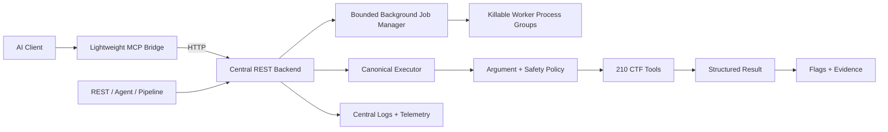

<div align="center">

```text
 ██████╗████████╗███████╗    ██╗  ██╗██╗████████╗
██╔════╝╚══██╔══╝██╔════╝    ██║ ██╔╝██║╚══██╔══╝
██║        ██║   █████╗      █████╔╝ ██║   ██║
██║        ██║   ██╔══╝      ██╔═██╗ ██║   ██║
╚██████╗   ██║   ██║         ██║  ██╗██║   ██║
 ╚═════╝   ╚═╝   ╚═╝         ╚═╝  ╚═╝╚═╝   ╚═╝
    ⚡ AI-POWERED CTF & CYBERSECURITY ENGINE ⚡
```

# CTF KIT

**Modular cybersecurity toolkit covering 210 specialized tools across 9 categories.**

Built for AI agents and direct automation through MCP and a headless REST API.

</div>

## Highlights

- 210 tools for encoding, crypto, stego, forensics, web, reverse engineering,
  pwn, OSINT, and general CTF workflows.
- Shared execution engine for MCP, REST, pipelines, and autonomous solving.
- Hypothesis-driven planning, CVE research, bounded attempts, and adaptive pivots.
- Structured execution statuses instead of ambiguous text-only success checks.
- Evidence-aware flag extraction with confidence scoring and false-positive filtering.
- Verified challenge memory, reproducible writeups, and deterministic evaluations.
- Automatic safety classification with no environment setup required.

## Architecture

The recommended deployment follows a lightweight MCP-client/central-backend
model. MCP forwards calls over HTTP to `server.py`; REST, pipelines, and the
autonomous solver then converge on the canonical executor in
`ctfkit/registry.py`. This centralizes logs, telemetry, caching, policy, and
tool execution while keeping the AI-facing MCP process small.



Every execution reports one explicit status: `success`, `no_finding`,
`unavailable`, `invalid_input`, `timeout`, `blocked`, or `error`. MCP additionally
publishes structured output and read-only/destructive/open-world annotations.

The autonomous flow is hypothesis-driven:

1. Profile the challenge and artifacts.
2. Recall verified knowledge and research known products/CVEs.
3. Rank hypotheses and assign a bounded attempt budget.
4. Execute the smallest relevant tool chain.
5. Pivot on `no_finding`, unavailable dependencies, or repeated failure.
6. Validate flag candidates with confidence and supporting evidence.
7. Persist learning only after a verified solve.

See [`docs/architecture.md`](docs/architecture.md) for the full execution and
trust-boundary design.

## Installation

### Requirements

- **Python**: 3.10+ (tested on Python 3.10, 3.11, 3.12, 3.13)
- **Git**: Installed and available in PATH

### 1. Clone

```bash
git clone https://github.com/clone4truth/ctf-kit.git
cd ctf-kit
```

### 2. Create a virtual environment

**Windows (PowerShell):**
```powershell
python -m venv .venv
.\.venv\Scripts\Activate.ps1
```

**Windows (Command Prompt):**
```cmd
python -m venv .venv
.\.venv\Scripts\activate.bat
```

**Linux / macOS (Bash / Zsh):**
```bash
python3 -m venv .venv
source .venv/bin/activate
```

### 3. Install dependencies

```bash
pip install --upgrade pip
pip install -r requirements.txt
```

### 4. Validate the installation

```bash
# Generate synthetic test data (PNG, WAV, PCAP, ELF, PE)
python tests/gen_testdata.py

# Run compile, unit/REST, smoke, MCP, core, and advanced checks
python scripts/verify.py
```

Install `requirements-dev.txt` and add `--build` to also verify both standalone
executables: `python scripts/verify.py --build`.

## Run CTF KIT

### REST API

```bash
python server.py
```

- **Swagger UI:** [http://localhost:8765/docs](http://localhost:8765/docs)
- **ReDoc:** [http://localhost:8765/redoc](http://localhost:8765/redoc)
- **Health:** [http://localhost:8765/health](http://localhost:8765/health)
- **Tool explorer:** [http://localhost:8765/dashboard](http://localhost:8765/dashboard)

> **REST security:** loopback is the default. `CTFKIT_API_TOKEN` is mandatory
> when binding to a non-loopback host and protects API and upload routes.
>
> **External dependencies:** wrappers do not install missing CLIs by default.
> Installation runs only when a caller explicitly passes `auto=true`; no
> environment setup is required. Docker fallback is
> disabled unless `CTFKIT_DOCKER=1` and runs read-only without network access.
>
> **LLM steering:** `CTFKIT_LLM_ENDPOINT` must use HTTPS or loopback. Tool output
> is not sent unless `CTFKIT_LLM_SHARE_OUTPUT=1` is explicitly enabled.

Risky tools automatically run in killable worker processes. Their arguments
travel over stdin rather than the process command line. No environment
configuration is needed for normal lab or tournament use.

Long-running work can use the persistent background-job API:

```text
POST /api/jobs                     submit a typed registry tool
GET  /api/jobs/{id}                lifecycle state + final result
GET  /api/jobs/{id}/output         incremental logs with a byte cursor
GET  /api/jobs/{id}/stream         live Server-Sent Events
POST /api/jobs/{id}/cancel         terminate the complete process group
```

Jobs are bounded by `CTFKIT_JOB_WORKERS` (default `4`) and persisted under
`memory/jobs/`. An in-progress job becomes `interrupted` after a backend restart;
sensitive-looking arguments are redacted in persisted metadata.

### MCP server

```bash
# Recommended: start the central backend first
python server.py

# MCP bridge used by the AI client
python mcp_server.py --server http://127.0.0.1:8765
```

Omit `--server` only when you intentionally want the legacy single-process
local mode. Remote backends support `--token`, `--timeout`, and `--retries`.

## MCP client setup

### Register the MCP server

Starting `mcp_server.py` performs no implicit installation or configuration
writes. Use the repository `.mcp.json`, configure the client manually, or run
`python scripts/install_agents.py` explicitly when you want to update supported
client configuration files.

| Artifact | Repo source | Installed to |
|---|---|---|
| ctf-memory plugin | `plugins/ctf-memory.js` | Supported agent plugin directories, only through the explicit installer |
| `ctf-tools` MCP server | `mcp_server.py` | Supported MCP client configuration, only through the explicit installer |

- **OS-aware**: uses `.venv/Scripts/python.exe` on Windows, `.venv/bin/python` on Linux/macOS (falls back to the running interpreter if the venv is missing).
- **Idempotent**: existing entries (other MCP servers, plugins, providers, project state) in every target config are preserved; missing configs are skipped.
- Project-level `.mcp.json` (in this repo) still works for clients that prefer local configs — see `mcp.example.json` for the template.

Manual registration on Linux/macOS (use the equivalent `.venv\Scripts\python.exe`
path on Windows):

```json
{
  "mcpServers": {
    "ctf-tools": {
      "command": "/absolute/path/to/ctf-kit/.venv/bin/python",
      "args": [
        "/absolute/path/to/ctf-kit/mcp_server.py",
        "--server",
        "http://127.0.0.1:8765"
      ],
      "env": {
        "PYTHONUNBUFFERED": "1",
        "CTFKIT_MCP_PROFILE": "simple"
      }
    }
  }
}
```

### Simple MCP usage

The recommended `simple` profile exposes a compact workflow surface plus
discovery, execution, telemetry, and background-job gateways while retaining
access to the complete registry:

1. Call `detect_challenge` or `plan_challenge` with the challenge statement.
2. Call `find_ctf_tools` when you need a specific technique or parameter schema.
3. Call `run_ctf_tool` with the selected name and arguments.
4. For long work, call `submit_background_job`, then poll
   `get_background_job`; use `cancel_background_job` when needed.
5. Call `extract_flags_tool`, then `remember_challenge` after verification.

This avoids sending 210 schemas to the AI client on every tool-list refresh.
Power users can set `CTFKIT_MCP_PROFILE=full` to expose every tool directly.
Run `python scripts/install_agents.py` once to register or update detected
clients to the recommended simple profile.

All MCP executions in central-backend mode appear in the `server.py` terminal
with `source=mcp` and a correlation ID. Inspect aggregate metrics at
`GET /api/telemetry`, active work at `GET /api/executions`, and an individual
run at `GET /api/executions/{execution_id}`.

The server terminal records every invocation's tool, category, source, status,
duration, and correlation/job ID. Background worker diagnostics are prefixed
with `[job:<id>]`. Full tool results remain in the structured API/MCP response
instead of being dumped to the terminal, which reduces accidental secret leaks.

## CTF workflow and memory

CTF KIT can turn a verified solve into reproducible local memory and a writeup:

```
[Challenge / Lab Input]
        │
        ├──▶ 1. Plan & Recall  : recall_knowledge / scripts/recall.py (Search past memory)
        ├──▶ 2. Solve          : Execute via 210 MCP tools
        └──▶ 3. Remember       : remember_challenge / scripts/remember.py
                  │
                  ├──▶ memory/*.md                  (Indexed Challenge Memory)
                  ├──▶ ~/.agents/skills/ctf-*        (Optional: CTFKIT_AUTO_SKILLS=1)
                  └──▶ writeups/<category>/*.md     (Auto-Scaffolded POC Walkthroughs)
```

### Persistence rules

When you recover a flag and call `remember_challenge`:

1. **Challenge Memory (`memory/`)**: Records target platform, tools used, recovered flag, and lessons learned. Automatically updates `memory/_index.md`.
2. **Autonomous Agent Skills (`~/.agents/skills/` & `~/.claude/skills/`)**: Disabled by default. Set `CTFKIT_AUTO_SKILLS=1` only after reviewing the solve evidence.
3. **POC Writeup (`writeups/`)**: Scaffolds a reproducible writeup template populated with terminal commands, payload parameters, and BurpSuite workflows tailored to the challenge category.

Synthetic/test titles are never persisted. Legacy aggregate learning with missing
provenance is never used for recommendations. Rebuild a clean v2 state with
`python scripts/rebuild_learning.py`; fixture solves remain visible but cannot
change rankings or fast paths.

```bash
python scripts/remember.py \
  --title "RSA Fermat Factorization" \
  --category crypto \
  --tool rsa_fermat \
  --flag "flag{fermat_crack_ok}" \
  --note "n was factored because its primes were close" \
  --problem "RSA modulus n used two close primes" \
  --commands "python solve.py"
```

## Automatic safety policy

No environment setup is required. CTF KIT determines each tool's capability
from registry metadata (`read_only`, `destructive`, `open_world`, and
`safety_level`) and applies the matching policy automatically. External package
installation requires an explicit `auto=true` tool argument. The autonomous
solver always uses `auto=false`, so it never installs packages implicitly.

`CTFKIT_SAFETY_MODE` remains available only as an optional lockdown override
for operators who deliberately want to restrict a deployment.

Only use network, exploitation, and scanning tools against systems you own or
are explicitly authorized to test.

## Tool categories

| Category | Tools | Examples |
|---|---:|---|
| Crypto | 48 | RSA attacks, AES modes, XOR, hashes, ECC, PRNG attacks |
| Web | 32 | HTTP, JWT, SQLi, SSTI, SSRF, upload bypass, CVE research |
| Forensics | 26 | PCAP, carving, archives, SQLite, PDF, filesystem artifacts |
| Misc and agent | 23 | planning, recall, orchestration, flag extraction, diagnostics |
| Encoding | 22 | common bases, Morse, zero-width, Brainfuck, decode chains |
| Stego | 18 | LSB, PNG chunks, image channels, audio, spectrograms |
| Pwn | 16 | checksec, ROP, shellcode, format strings, ret2libc helpers |
| OSINT | 14 | DNS, WHOIS, ASN, certificates, geolocation, search helpers |
| Reverse engineering | 11 | ELF, PE, PYC, symbols, constants, binary searches |
| **Total** | **210** | Available through MCP and REST |

Use `GET /api/tools`, the Swagger UI, or MCP `tools/list` for the current
per-tool schemas and descriptions.

## Core capabilities

- **Flag engine:** ranks candidates with confidence and filters common CSS/code
  false positives without assuming a fixed prefix.
- **Planning engine:** generates prioritized hypotheses and bounded execution
  plans before attempting a challenge.
- **Browser agent:** inspects rendered content, forms, links, screenshots, and
  security headers for authorized web challenges.
- **Linux analysis:** parses common system artifacts, histories, scheduled jobs,
  capabilities, network data, and executable metadata.
- **Smart cache:** caches deterministic results and invalidates file-backed keys
  when file size or modification time changes.
- **Health and telemetry:** exposes readiness checks, execution status, duration,
  cache state, and redacted diagnostic history.

## Validation status

- 210 registry tools plus 6 backend transport/job tools exposed through a
  successful full-profile MCP JSON-RPC handshake (216 schemas total).
- 117/117 configured smoke scenarios pass, including expected negative probes.
- 33/33 unit, REST, remote-backend, installer, job-lifecycle, and security regression tests pass.
- Local quality benchmark: **10.0/10** — core evaluation plus a 7/7 advanced
  release gate covering real RSA decryption, nonce reuse, pwn payload ordering,
  repeating-key XOR, layered URL decoding, and archive metadata.
- REST `/health` reports registry, memory, and test-data readiness checks.

Run the complete local verification:

```bash
python scripts/verify.py
```

## Design references

The architecture is informed by the Model Context Protocol tool contract and
agent research including ReAct, Reflexion, and AgentBench. See
[`docs/references.md`](docs/references.md) for the primary references and the
recommended evaluation methodology.

## License

CTF KIT is released under the [MIT License](LICENSE). Copyright © 2026 arseno25.
